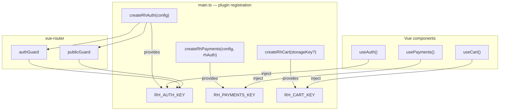

# @ulabase/kit-vue

Vue adapter for `@ulabase/kit`. Wraps the core authentication, payments, and cart logic in Vue plugins with composables and navigation guards. A `/nuxt` subpath adds Nuxt SSR support.

## Installation

```bash
npm install @ulabase/kit-vue @ulabase/kit
```

The core `@ulabase/kit` is a regular dependency — pulled in automatically.

`vue-router` (for guards) and `h3` (for `/nuxt` subpath) are **optional peer dependencies**. `vue >= 3.4` is required.

## Architecture

The package exposes three independent plugin families, each following the same pattern: a `create*` factory returns a Vue plugin with an `install` method, and a `use*` composable retrieves the injected store at the component level.



Each `use*` composable throws a descriptive error if the corresponding plugin was not registered. The injection keys (`RH_AUTH_KEY`, `RH_PAYMENTS_KEY`, `RH_CART_KEY`) are typed `InjectionKey` symbols exported for advanced wiring.

## Quick Start

### 1. Install Plugin

```ts
import { createRhAuth } from '@ulabase/kit-vue';

const rhAuth = createRhAuth({ apiBaseUrl: import.meta.env.VITE_API_URL });
app.use(rhAuth);
```

### 2. Wire Guards

```ts
router.beforeEach(rhAuth.authGuard);
```

At creation the store runs `checkSession()` once, restoring the session before the first guard evaluates. Until it settles, `initializing.value` is `true`.

### 3. Use `useAuth` Composable

```vue
<script setup lang="ts">
import { useAuth } from '@ulabase/kit-vue';
const auth = useAuth();
</script>

<template>
  <template v-if="auth.isAuthenticated.value">
    <span>{{ auth.user.value?.profile?.name }}</span>
    <TeamSwitcher v-if="auth.hasMultipleTeams.value" :teams="auth.teams.value" />
  </template>
</template>
```

## Auth State (Vue Refs)

| Field | Type | Description |
|-------|------|-------------|
| `user` | `Ref<UserInfo \| null>` | Current authenticated user |
| `teams` | `Ref<TeamMembership[]>` | User's team memberships |
| `isAuthenticated` | `ComputedRef<boolean>` | Whether user is logged in |
| `initializing` | `Ref<boolean>` | True during initial `checkSession` |
| `hasMultipleTeams` | `ComputedRef<boolean>` | True if `teams.length > 1` |

## Auth Methods

All methods are available on the `useAuth()` return value. These wrap `@ulabase/kit` functions and update reactive state (`user`, `teams`) where applicable:

```ts
const auth = useAuth();

// Session
await auth.checkSession();              // → UserInfo | null
auth.clearSession();                    // clear token, cancel refresh, reset state

// Registration & verification
await auth.register({ email, password, teamName, firstName, lastName });
await auth.verify(email, token, delivery?);  // delivery: 'cookie' | 'fragment', default 'fragment'

// Login / logout
await auth.login(email, password, mode?);   // mode: 'bearer' (default) | 'cookie'
await auth.logout();

// Password
await auth.forgotPassword(email);
await auth.resetPassword({ email, token, password }, mode?);
await auth.changePassword(currentPassword, newPassword);

// Profile
await auth.updateProfile({ firstName?, lastName? });
await auth.updateUser(email, updates);     // generic user update

// Consents & token
await auth.acceptConsents(body?, mode?);   // → UserInfo; records consent, renews token
await auth.renewToken(mode?);              // → string | null; forces a fresh token

// Teams
await auth.loadTeams();                 // → TeamMembership[]
await auth.switchTeam({ $oid }, mode?);
await auth.createTeam(teamName);        // → TeamMembership
await auth.updateTeam({ name?, description? });
await auth.deleteTeam();
await auth.listTeamMembers();           // → TeamMember[]
await auth.removeMember(email);
await auth.updateMemberRole(email, role);

// Invitations
await auth.invite(email, role);         // role: 'owner' | 'member'
await auth.getInvitation(email, token); // → Invitation
await auth.activate({ email, token, password }, mode?);
await auth.acceptInvite(token);
await auth.resendInvite(email);
await auth.listInvitations();           // → PendingInvitation[]
```

#### Authenticated Fetch

```typescript
// Authenticated GET — bearer token attached automatically
auth.api(path: string, init?: RequestInit): Promise<Response>
```

`auth.api()` wraps the core `apiFetch` so that application requests to RESTHeart collections carry the session token automatically. Vue has no interceptor slot, so this is the primary way to make authenticated API calls from Vue components.

```vue
<script setup lang="ts">
import { useAuth } from '@ulabase/kit-vue';
const auth = useAuth();

async function loadItems() {
  const res = await auth.api('/my-collection?pagesize=10');
  const docs = await res.json();
}
</script>
```

Rejects with an `ApiError` (`{ status, message }`) on any non-2xx response. See [Core Kit — Authenticated Fetch](kit.md#authenticated-fetch-apifetch) for the underlying behavior.

**When to use**: Use `auth.api()` for any RESTHeart API call from Vue components that is not already covered by a dedicated method (e.g., querying custom collections).

Methods that perform auto-login (`login`, `activate`, `resetPassword`, `switchTeam`) accept an optional `mode` parameter (`'bearer'` | `'cookie'`) that maps to the backend's `delivery` query parameter.

## Payments Plugin

The payments plugin is separate from auth because a subscription is not a session. See [Payments & E-commerce](../concepts/payments.md) for the underlying concepts.

```ts
import { createRhAuth, createRhPayments } from '@ulabase/kit-vue';

const config = { apiBaseUrl: import.meta.env.VITE_API_URL, payments: true };
const rhAuth = createRhAuth(config);
const rhPayments = createRhPayments(config, rhAuth);

app.use(rhAuth);
app.use(rhPayments);
```

`createRhPayments` accepts either the `RhAuth` object returned by `createRhAuth` or the bare `RhAuthStore` — so either `createRhPayments(config, rhAuth)` or `createRhPayments(config, rhAuth.store)` works.

Without `config.payments === true` the store still exists, but no `/stripe/*` call is ever made.

### `usePayments` Composable

```vue
<script setup lang="ts">
import { usePayments } from '@ulabase/kit-vue';
const payments = usePayments();
</script>

<template>
  <p v-if="payments.subscription.value">Plan: {{ payments.plan.value }}</p>
  <button v-if="payments.canManageBilling.value" @click="openPortal">Manage billing</button>
</template>
```

### Payments State (Vue Refs)

| Field | Type | Description |
|-------|------|-------------|
| `subscription` | `Ref<Subscription \| null>` | The team's current subscription |
| `plan` | `ComputedRef<string \| null>` | Plan id from the subscription, or `null` |
| `isSubscribed` | `ComputedRef<boolean>` | Whether the team has an active subscription |
| `canManageBilling` | `ComputedRef<boolean>` | `true` when `user.team.role` matches `ownershipRole` (default `'owner'`) |
| `seatsAvailable` | `ComputedRef<number \| null>` | Available seats, or `null` if unlimited / no subscription |

The payments store watches the auth store's `user` ref. It loads the subscription on sign-in and on team switch, and clears it on sign-out. Internally it tracks `user.team._id.$oid` rather than the user object itself, so profile edits and consent acceptances do not trigger unnecessary subscription reloads.

### Payments Methods

```ts
const payments = usePayments();

// Subscription
await payments.loadSubscription();                         // → Subscription | null
await payments.getPlans();                                 // → { default_plan, plans } (no session required)
await payments.createCheckoutSession(plan, interval);      // → { url } — rejects 409 if already subscribed
await payments.openBillingPortal();                        // → { url } — rejects 402 if never checked out

// Seat licences (requires canManageBilling)
await payments.getLicenses();                              // → Licenses
await payments.grantLicense(userId);                       // → 'granted' | 'already-licensed'
await payments.revokeLicense(userId);

// Product catalog & orders
await payments.getCatalog(opts?);                          // → CatalogItem[]
await payments.createOrder(items, email?, collection?);    // → { _id, checkout_url, secret }
await payments.getOrder(id, secret?, collection?);         // → Order

// Polling helpers (use on success pages after Stripe redirect)
await payments.waitForSubscription(predicate, opts?);      // → Subscription (rejects WaitTimeoutError)
await payments.waitForOrder(id, secret?, opts?);           // → Order (rejects WaitTimeoutError)
```

`createCheckoutSession` rejects with `status: 409` when the team already has an active subscription. Send them to `openBillingPortal` instead, where Stripe handles plan changes. `openBillingPortal` rejects with `status: 402` for a team that has never checked out — route a `402` to `createCheckoutSession`.

`waitForSubscription` and `waitForOrder` poll until the predicate/order state changes. **Timing out is not a payment failure** — they reject with `WaitTimeoutError` when the Stripe webhook hasn't arrived yet. Use them on the Checkout success page to handle the redirect-vs-webhook race.

## Cart Plugin

The cart is a browser-local construct, independent of authentication. A shop that forces sign-in before adding to a basket loses most of its visitors at that door. The cart becomes an order when `orderItems` is handed to `createOrder`.

```ts
import { createRhCart } from '@ulabase/kit-vue';

const rhCart = createRhCart();       // optional: custom storageKey
app.use(rhCart);
```

`createRhCart` takes no config — nothing here talks to a service. An optional `storageKey` parameter (default `'rh-cart'`) controls the `localStorage` key; set it when two apps share an origin.

### `useCart` Composable

```vue
<script setup lang="ts">
import { useCart } from '@ulabase/kit-vue';
const cart = useCart();

function buy(item: { productId: string; name: string; unitAmount: number }) {
  cart.add(item);
}
</script>

<template>
  <button @click="cart.add({ productId: 'mug', name: 'Enamel mug', unitAmount: 1450 })">
    Add to cart
  </button>
  <p>{{ cart.totalItems.value }} items — {{ cart.subtotal.value }} {{ cart.currency.value }}</p>
</template>
```

### Cart State (Vue Refs)

| Field | Type | Description |
|-------|------|-------------|
| `lines` | `Ref<CartLine[]>` | Cart lines in insertion order |
| `totalItems` | `ComputedRef<number>` | Total units (not lines — two of one item counts two) |
| `subtotal` | `ComputedRef<number>` | Sum in minor units (display-only, meaningful when all lines share a currency) |
| `currency` | `ComputedRef<string>` | First line's currency, or `'eur'` when empty |
| `orderItems` | `ComputedRef<OrderItem[]>` | Cart as `createOrder` expects it |

### Cart Methods

```ts
const cart = useCart();

cart.add(item, quantity?);                // adds item or increases existing line
cart.setQuantity(productId, quantity);     // zero removes the line
cart.remove(productId);
cart.clear();
```

State and `localStorage` update together in the same operation — not via a `watch`, because a watcher would run after the fact and could restore a line that was just removed. On the server, `localStorage` does not exist and the cart reads as empty; an SSR'd cart count starts at zero and fills in once the browser takes over.

## Navigation Guards

`createRhAuth` returns two `vue-router` `NavigationGuard` functions bound to the store:

| Guard | Behavior | Redirects to |
|-------|----------|-------------|
| `authGuard` | Blocks unauthenticated users | `loginPath` (default `/auth/login`) |
| `publicGuard` | Blocks authenticated users (login/register pages) | `appPath` (default `/`) |

```ts
// router.ts
router.beforeEach(rhAuth.authGuard);

// or per-route
{ path: '/app', beforeEnter: rhAuth.authGuard }
{ path: '/auth/login', beforeEnter: rhAuth.publicGuard }
```

Both guards check the in-memory session first and fall back to a `checkSession()` round trip. Both guards and the store derive from the same store instance, so `useAuth()` inside components sees the identical state.

Leave `/invitations/accept` outside both guards — it must work for signed-out invitees, signed-in users, and people without an account.

`buildGuards` is also exported directly if you manage the store yourself:

```ts
import { buildGuards } from '@ulabase/kit-vue';
const { authGuard, publicGuard } = buildGuards(store, { loginPath: '/signin', appPath: '/dashboard' });
```

### `GuardOptions`

| Option | Default | Description |
|--------|---------|-------------|
| `loginPath` | `/auth/login` | Where `authGuard` redirects unauthenticated users |
| `appPath` | `/` | Where `publicGuard` redirects authenticated users |

## Injection Keys

The package exports three typed Vue `InjectionKey` symbols:

| Key | Used by |
|-----|---------|
| `RH_AUTH_KEY` | `createRhAuth` / `useAuth` |
| `RH_PAYMENTS_KEY` | `createRhPayments` / `usePayments` |
| `RH_CART_KEY` | `createRhCart` / `useCart` |

## Nuxt Subpath (`/nuxt`)

```ts
import {
  // Server middleware
  rhAuthServerMiddleware,         // h3 middleware: refresh at 80% TTL, protected/public redirects
  type RhServerMiddlewareOptions,

  // Session handler
  createSessionHandler,           // POST/DELETE session cookie management
  type SessionHandlerOptions,

  // Server actions
  rhLogin,                        // server-side login (sets cookie)
  rhSwitchTeam,                   // server-side team switch
  rhActivate,                     // activate invitation account
  rhResetPassword,                // reset password with token
  rhLogout,                       // server-side logout (clears cookie)

  // Client utilities
  syncServerSession,              // POST token to session endpoint
  clearServerSession,             // DELETE session endpoint
  bridgeFragmentToCookie,         // reads #access_token, POSTs to session handler
  DEFAULT_SESSION_ENDPOINT,       // '/api/rh/session'

  // Session reading (server)
  getServerSession,               // read session from request cookie → UserInfo | null
  getServerSessionWithTeams,      // read session + load teams

  // Cookie utilities
  RH_SESSION_COOKIE,
  DEFAULT_COOKIE_OPTIONS,
  rhServerConfig,
  cookieMaxAge,
  resolveCookieOptions,
  type SessionCookieOptions,
  type ServerActionOptions,
} from '@ulabase/kit-vue/nuxt';
```

The `/nuxt` subpath provides:
- **Server middleware** (`rhAuthServerMiddleware`): token refresh at 80% TTL, protected/public path redirects
- **Session handler** (`createSessionHandler`): session cookie management (POST writes cookie, DELETE clears)
- **Server actions** (`rhLogin`, `rhSwitchTeam`, `rhActivate`, `rhResetPassword`, `rhLogout`): server-side auth operations that set or clear the session cookie
- **Fragment→cookie bridge** (`bridgeFragmentToCookie`): reads `#access_token` from URL and POSTs to the session handler so the server can set a first-party cookie
- **Session readers** (`getServerSession`, `getServerSessionWithTeams`): read the current user from the request cookie in server context
- **Cookie utilities**: `RH_SESSION_COOKIE`, `DEFAULT_COOKIE_OPTIONS`, `rhServerConfig`, `cookieMaxAge`, `resolveCookieOptions`

Uses the core's [pluggable token source and sink](../architecture/overview.md#pluggable-token-source-and-sink) to read tokens from request cookies and capture tokens for cookie writes — no `localStorage` on the server.

The server actions use a `runCapturing` helper that overrides `getToken` and `setToken` on the config to capture the newly issued token into the response cookie instead of touching `localStorage`. The `getToken` source reads from the current cookie first, then falls back to the captured token — so `login` can fetch `/users/me` with the token it just obtained, and `switchTeam` authorises with the existing session.

## Source Map

| Source file | Responsibility |
|-------------|---------------|
| `src/create.ts` | `createRhAuth` Vue plugin |
| `src/store.ts` | `createRhAuthStore`, `RhAuthStore` interface |
| `src/use-auth.ts` | `useAuth` composable |
| `src/guards.ts` | `buildGuards` for vue-router |
| `src/keys.ts` | `RH_AUTH_KEY`, `RH_PAYMENTS_KEY`, `RH_CART_KEY` injection keys |
| `src/create-payments.ts` | `createRhPayments` Vue plugin |
| `src/payments.ts` | `createRhPaymentsStore`, `RhPaymentsStore` interface |
| `src/use-payments.ts` | `usePayments` composable |
| `src/create-cart.ts` | `createRhCart` Vue plugin |
| `src/cart-store.ts` | `createRhCartStore`, `RhCartStore` interface |
| `src/use-cart.ts` | `useCart` composable |
| `src/index.ts` | SPA barrel export (also re-exports `@ulabase/kit`) |
| `src/nuxt/middleware.ts` | `rhAuthServerMiddleware` |
| `src/nuxt/handler.ts` | `createSessionHandler` |
| `src/nuxt/actions.ts` | `rhLogin`, `rhSwitchTeam`, `rhActivate`, `rhResetPassword`, `rhLogout` |
| `src/nuxt/session.ts` | `getServerSession`, `getServerSessionWithTeams` |
| `src/nuxt/client.ts` | `syncServerSession`, `clearServerSession`, `bridgeFragmentToCookie` |
| `src/nuxt/cookies.ts` | Cookie constants and resolution |
| `src/nuxt/index.ts` | `/nuxt` subpath barrel export |

## See Also

- [Core Kit](kit.md) — API reference for `@ulabase/kit`
- [Payments & E-commerce](../concepts/payments.md) — Subscriptions, catalog, orders, and cart concepts
- [Adapter Contract](../testing/guide.md#adapter-unit-tests) — Shared test checklist
- [Token Delivery](../architecture/token-delivery.md) — Bearer vs cookie modes
